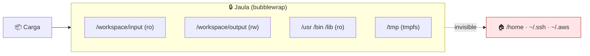

# Lab 03 · Jaula de filesystem

> **Nivel:** `initial` · **Estado:** `ready`

Montar una raíz mínima para que la carga solo vea lo que necesita, y comprobar que no ve el resto.

---

## 🎯 Por qué importa

El control de filesystem es el que más se da por hecho y el que más falla. Un
`chroot` sin namespace de montaje se escapa; un bind mount de más deja `~/.ssh`
a la vista. La diferencia entre creerlo y saberlo es ejecutar la sonda.

---

## 🗺️ Cómo funciona



---

## ▶️ Práctica

```bash
# Qué ve la carga dentro de la jaula
cargo run -p sandboxctl -- escape --runtime bwrap 2>&1 | grep filesystem

# Contraste directo: lo mismo sin jaula
SANDBOX_LABS_ALLOW_NATIVE=1 \
  cargo run -p sandboxctl -- escape --runtime native 2>&1 | grep filesystem

# El plan que produce esa jaula
cargo run -p sandboxctl -- plan \
  --workload workloads/escape/filesystem-escape \
  --runtime bwrap --policy policies/containment-audit.json
```

### Salida esperada

```text
# con bwrap
filesystem-escape                  ✅
  → ninguna ruta sensible del host es legible
  → sin escritura fuera del workspace
  → el árbol del host no es visible

# con native
filesystem-escape                  ❌
  → rutas sensibles legibles: ~/.aws/credentials
  → árbol del host visible: /home, /mnt
```

---

## ✅ Cómo se verifica

La sonda mide tres cosas distintas que suelen confundirse: **lectura** de
secretos, **escritura** fuera del workspace y **visibilidad** del árbol real. Un
runtime puede contener la escritura y filtrar la lectura, así que las tres se
reportan por separado.

---

## 🏭 Caso de uso real

Ejecutar el `build` de una dependencia con scripts de post-instalación sin que
pueda leer las credenciales del desarrollador ni dejar nada fuera del directorio
de salida.

---

## ⚠️ Errores comunes

- `unshare` **no** ofrece jaula de filesystem: crea el namespace de montaje pero no monta una raíz nueva. La matriz de contención lo muestra en rojo a propósito.
- Un bind mount de `/etc` completo mete `/etc/shadow` dentro de la jaula. Monta solo `passwd` y `group` si los necesitas.

---

## 🧾 Evidencia

Cada ejecución con `sandboxctl run` deja un JSON en `evidence/runs/` con:

| Campo | Qué prueba |
|---|---|
| `integrity.policySha256` | Qué política exacta se aplicó |
| `integrity.workloadSha256` | Qué código exacto se ejecutó |
| `policy.effectiveControls` | Qué controles se aplicaron de verdad |
| `policy.unsupportedControls` | Qué pidió la política y no se pudo aplicar |
| `result` | Estado, código de salida y salida acotada |

Formato completo en [docs/EVIDENCE_FORMAT.md](../../docs/EVIDENCE_FORMAT.md).

---

## 🔗 Siguiente paso

**Lab 04 · Namespaces de Linux** → [`04-linux-namespaces/`](../04-linux-namespaces/)

> [!WARNING]
> No ejecutes código desconocido en tu equipo de trabajo. `experimental` no
> significa apto para cargas hostiles: usa una VM que puedas destruir.
