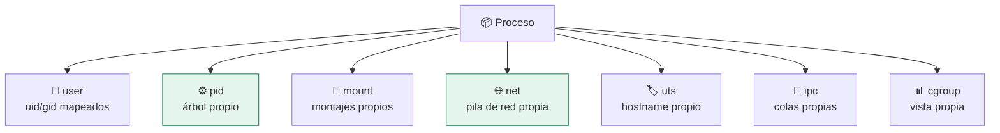

# Lab 04 · Namespaces de Linux

> **Nivel:** `core` · **Estado:** `ready`

Los siete namespaces del kernel y qué aísla cada uno — con la prueba de que el de PID solo funciona si remontas `/proc`.

---

## 🎯 Por qué importa

Los namespaces son el ladrillo de todos los contenedores. Y son el sitio donde
el aislamiento falla en silencio: crear un namespace de PID sin remontar `/proc`
deja al proceso viendo los PIDs del host. El namespace existe; simplemente no se
nota.

---

## 🗺️ Cómo funciona



---

## ▶️ Práctica

```bash
# Namespaces del proceso actual
ls -l /proc/self/ns/

# El fallo clásico: PID namespace SIN remontar /proc
unshare --user --map-root-user --pid --fork ps -e | wc -l   # ve el host

# Corregido: con /proc remontado
unshare --user --map-root-user --pid --fork --mount-proc ps -e | wc -l

# La sonda que detecta la diferencia
cargo run -p sandboxctl -- escape --runtime unshare 2>&1 | grep process
```

### Salida esperada

```text
# sin --mount-proc: decenas de procesos del host
48

# con --mount-proc: solo el namespace
2

process-visibility                 ✅
  → solo 2 PIDs visibles, propio PID 1
```

---

## ✅ Cómo se verifica

Este laboratorio documenta un fallo **real y corregido** en este repositorio: el
adaptador `unshare` creaba el namespace de PID sin `--mount-proc`, y la suite de
contención lo detectó en la primera ejecución. Ver `crates/sandbox-
runtimes/src/adapters/unshare.rs`.

---

## 🏭 Caso de uso real

Aislar un runner de CI para que un job no pueda inspeccionar ni señalizar los
procesos de los demás jobs que comparten la máquina.

---

## ⚠️ Errores comunes

- PID namespace sin `--mount-proc` = falso aislamiento. Es el error más común y el más silencioso.
- El namespace de red sin configurar deja al proceso sin *ninguna* red, ni siquiera loopback. Para muchas cargas eso es lo correcto.

---

## 🧾 Evidencia

Cada ejecución con `sandboxctl run` deja un JSON en `evidence/runs/` con:

| Campo | Qué prueba |
|---|---|
| `integrity.policySha256` | Qué política exacta se aplicó |
| `integrity.workloadSha256` | Qué código exacto se ejecutó |
| `policy.effectiveControls` | Qué controles se aplicaron de verdad |
| `policy.unsupportedControls` | Qué pidió la política y no se pudo aplicar |
| `result` | Estado, código de salida y salida acotada |

Formato completo en [docs/EVIDENCE_FORMAT.md](../../docs/EVIDENCE_FORMAT.md).

---

## 🔗 Siguiente paso

**Lab 05 · Límites de recursos: cgroups v2 y rlimits** → [`05-cgroups-limits/`](../05-cgroups-limits/)

> [!WARNING]
> No ejecutes código desconocido en tu equipo de trabajo. `experimental` no
> significa apto para cargas hostiles: usa una VM que puedas destruir.
