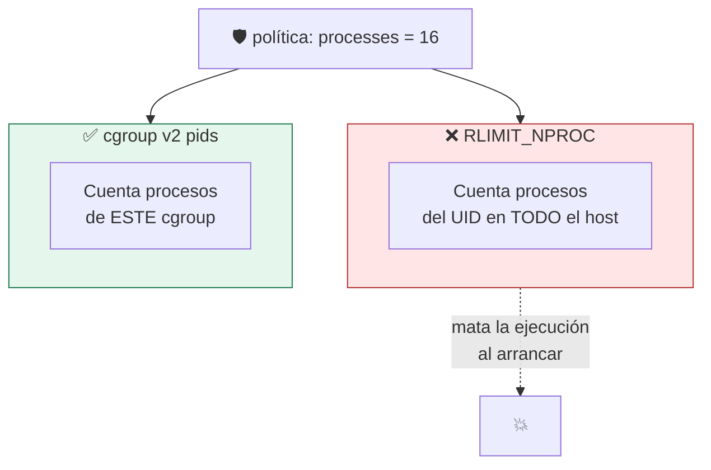

# Lab 05 · Límites de recursos: cgroups v2 y rlimits

> **Nivel:** `core` · **Estado:** `documented`

Por qué `RLIMIT_NPROC` **no** es un límite de procesos de contenedor, y qué sí lo es.

---

## 🎯 Por qué importa

Este laboratorio existe por un hallazgo de la suite de contención en este mismo
repositorio: los adaptadores declaraban el control `processes` porque envolvían
la carga con `prlimit --nproc`. Pero RLIMIT_NPROC cuenta los procesos del **UID
en todo el host**, no los de la carga. Fijarlo al presupuesto de la política
mataba la ejecución nada más empezar, y peor: hacía pasar por control de
contención algo que no lo era.

---

## 🗺️ Cómo funciona



---

## ▶️ Práctica

```bash
# ¿Hay cgroups v2 en este host?
cat /proc/self/cgroup
ls /sys/fs/cgroup/cgroup.controllers

# El límite de memoria SÍ funciona por proceso (RLIMIT_AS)
prlimit --as=67108864 python3 -c "bytearray(200*1024*1024)"

# Qué contiene realmente cada runtime en memoria y procesos
cargo run -p sandboxctl -- escape 2>&1 | grep -E "memory|process-limit"
```

### Salida esperada

```text
MemoryError                       # RLIMIT_AS corta de verdad

memory-limit                       ✅   → MemoryError tras 128 MB
process-limit                      ❌   → creados 32 procesos con presupuesto de 16
```

---

## ✅ Cómo se verifica

El ❌ de `process-limit` es **correcto y deliberado**. Ningún runtime local
aplica todavía un techo real de PIDs, así que el control `processes` no se
declara: no hay falsa garantía. Implementarlo con el controlador `pids` de
cgroups v2 está en [el backlog](../../docs/IMPLEMENTATION_BACKLOG.md).

---

## 🏭 Caso de uso real

Dimensionar un runner multi-tenant: cuánta memoria y cuántos PIDs puede consumir
un tenant antes de degradar a los demás, y con qué mecanismo se garantiza.

---

## ⚠️ Errores comunes

- `RLIMIT_NPROC` es **por UID**, no por proceso ni por cgroup. No sirve como límite de contenedor.
- `RLIMIT_AS` limita espacio de direcciones virtual, no residente. Para un techo de RSS necesitas `memory.max` de cgroups v2.
- En WSL2 y en contenedores, la delegación de cgroups suele estar restringida: comprueba antes de asumir.

---

## 🧾 Evidencia

Cada ejecución con `sandboxctl run` deja un JSON en `evidence/runs/` con:

| Campo | Qué prueba |
|---|---|
| `integrity.policySha256` | Qué política exacta se aplicó |
| `integrity.workloadSha256` | Qué código exacto se ejecutó |
| `policy.effectiveControls` | Qué controles se aplicaron de verdad |
| `policy.unsupportedControls` | Qué pidió la política y no se pudo aplicar |
| `result` | Estado, código de salida y salida acotada |

Formato completo en [docs/EVIDENCE_FORMAT.md](../../docs/EVIDENCE_FORMAT.md).

---

## 🔗 Siguiente paso

**Lab 06 · Capabilities de Linux** → [`06-linux-capabilities/`](../06-linux-capabilities/)

> [!WARNING]
> No ejecutes código desconocido en tu equipo de trabajo. `experimental` no
> significa apto para cargas hostiles: usa una VM que puedas destruir.
