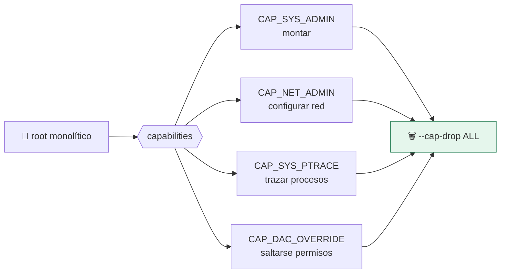

# Lab 06 · Capabilities de Linux

> **Nivel:** `core` · **Estado:** `ready`

Trocear el privilegio de root y quitarlo todo por defecto.

---

## 🎯 Por qué importa

«Root o no root» es una simplificación que se rompe en cuanto miras `CapEff`. Un
proceso puede no ser root y conservar `CAP_NET_RAW`; o ser root en un namespace
y no tener ninguna capability útil fuera. Auditar la máscara es la única lectura
fiable.

---

## 🗺️ Cómo funciona



---

## ▶️ Práctica

```bash
# La máscara efectiva del proceso actual
grep CapEff /proc/self/status
capsh --decode=$(grep CapEff /proc/self/status | awk '{print $2}')  # si tienes libcap

# Lo que hace el adaptador de bubblewrap
grep -n "cap-drop" crates/sandbox-runtimes/src/adapters/bwrap.rs

# La sonda que lo verifica
cargo run -p sandboxctl -- escape --runtime bwrap 2>&1 | grep privilege
```

### Salida esperada

```text
CapEff: 0000000000000000

privilege-check                    ✅
  → sin capabilities peligrosas (uid=0, euid=0, CapEff=0x0000000000000000)
```

---

## ✅ Cómo se verifica

`CapEff: 0000000000000000` es el objetivo: cero capabilities efectivas. La sonda
comprueba ocho capabilities concretas (`SYS_ADMIN`, `SYS_MODULE`, `SYS_PTRACE`,
`NET_ADMIN`, `NET_RAW`, `SYS_BOOT`, `DAC_OVERRIDE`, `DAC_READ_SEARCH`) y
distingue si están acotadas a un namespace.

---

## 🏭 Caso de uso real

Revisar por qué un contenedor «sin privilegios» puede seguir haciendo `ping` —
`CAP_NET_RAW` viene por defecto en muchos runtimes— y decidir si eso es
aceptable para tu carga.

---

## ⚠️ Errores comunes

- Quitar capabilities no reduce la superficie de syscalls: para eso está seccomp (lab 07).
- El bounding set importa tanto como el efectivo: sin quitarlo, un binario setuid puede recuperarlas.

---

## 🧾 Evidencia

Cada ejecución con `sandboxctl run` deja un JSON en `evidence/runs/` con:

| Campo | Qué prueba |
|---|---|
| `integrity.policySha256` | Qué política exacta se aplicó |
| `integrity.workloadSha256` | Qué código exacto se ejecutó |
| `policy.effectiveControls` | Qué controles se aplicaron de verdad |
| `policy.unsupportedControls` | Qué pidió la política y no se pudo aplicar |
| `result` | Estado, código de salida y salida acotada |

Formato completo en [docs/EVIDENCE_FORMAT.md](../../docs/EVIDENCE_FORMAT.md).

---

## 🔗 Siguiente paso

**Lab 07 · Seccomp: reducir la superficie de syscalls** → [`07-seccomp-syscalls/`](../07-seccomp-syscalls/)

> [!WARNING]
> No ejecutes código desconocido en tu equipo de trabajo. `experimental` no
> significa apto para cargas hostiles: usa una VM que puedas destruir.
