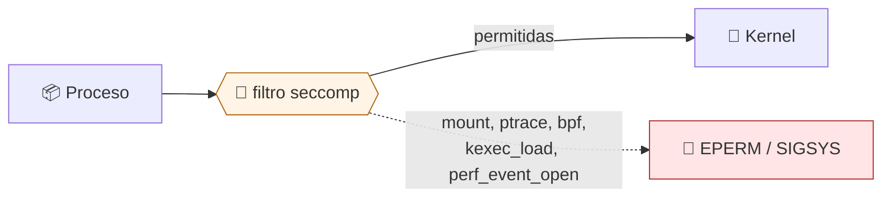

# Lab 07 · Seccomp: reducir la superficie de syscalls

> **Nivel:** `core` · **Estado:** `documented`

Filtrar las llamadas al sistema que la carga puede hacer, y entender el coste de equivocarse.

---

## 🎯 Por qué importa

Namespaces y capabilities acotan *qué recursos* ve el proceso. Seccomp acota
*qué le puede pedir al kernel*, que es la superficie por la que se explotan las
vulnerabilidades del propio kernel. Es el control con mejor relación entre
reducción de riesgo y complejidad — y el más fácil de romper si te pasas de
restrictivo.

---

## 🗺️ Cómo funciona



---

## ▶️ Práctica

```bash
# El perfil de referencia del repositorio
cat profiles/seccomp/strict.json

# Qué syscalls deniega la política de alto riesgo
python3 -c "import json;print(json.load(open('policies/high-risk.json'))['syscalls'])"

# ¿Hay seccomp activo en este proceso?
grep Seccomp /proc/self/status
```

### Salida esperada

```text
{'profile': 'strict', 'allow': [], 'deny': ['mount', 'ptrace', 'reboot',
 'kexec_load', 'bpf', 'perf_event_open', 'clone3']}

Seccomp:    0        # 0 = sin filtro, 2 = filtro activo
```

---

## ✅ Cómo se verifica

**Estado honesto:** el perfil existe y la política lo declara, pero los
adaptadores todavía no lo imponen. Por eso el control `syscalls` **no** aparece
en `supported_controls` de ningún runtime local, y una política `strict` que lo
exija falla cerrada. Declararlo sin aplicarlo sería exactamente la falsa
garantía que este proyecto persigue.

---

## 🏭 Caso de uso real

Bloquear `clone3` en cargas que no lo necesitan: es la syscall por la que varias
fugas de contenedor esquivaron filtros escritos solo para `clone`.

---

## ⚠️ Errores comunes

- Una lista de denegación se queda obsoleta con cada kernel nuevo. Las listas de permisos son más seguras y mucho más caras de mantener.
- `SIGSYS` mata el proceso sin mensaje útil. Para depurar, empieza registrando en vez de matando.

---

## 🧾 Evidencia

Cada ejecución con `sandboxctl run` deja un JSON en `evidence/runs/` con:

| Campo | Qué prueba |
|---|---|
| `integrity.policySha256` | Qué política exacta se aplicó |
| `integrity.workloadSha256` | Qué código exacto se ejecutó |
| `policy.effectiveControls` | Qué controles se aplicaron de verdad |
| `policy.unsupportedControls` | Qué pidió la política y no se pudo aplicar |
| `result` | Estado, código de salida y salida acotada |

Formato completo en [docs/EVIDENCE_FORMAT.md](../../docs/EVIDENCE_FORMAT.md).

---

## 🔗 Siguiente paso

**Lab 08 · Landlock: restringir el filesystem desde el propio proceso** → [`08-landlock-policies/`](../08-landlock-policies/)

> [!WARNING]
> No ejecutes código desconocido en tu equipo de trabajo. `experimental` no
> significa apto para cargas hostiles: usa una VM que puedas destruir.
