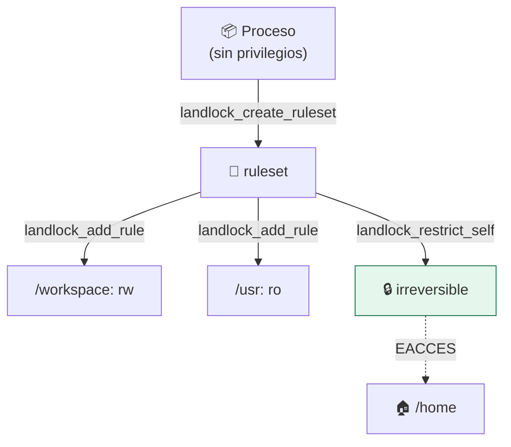

# Lab 08 · Landlock: restringir el filesystem desde el propio proceso

> **Nivel:** `core` · **Estado:** `documented`

Un LSM sin privilegios con el que un proceso se ata las manos a sí mismo, sin root y sin namespaces.

---

## 🎯 Por qué importa

Landlock ocupa un hueco que nada más cubre: restringir el acceso al filesystem
**desde dentro** del proceso, sin necesitar privilegios ni montar nada. Es la
vía natural para que una aplicación se limite antes de cargar un plugin de
terceros.

---

## 🗺️ Cómo funciona



---

## ▶️ Práctica

```bash
# ¿Soporta este kernel Landlock, y en qué versión de ABI?
grep -i landlock /proc/kallsyms 2>/dev/null | head -3
uname -r    # Landlock necesita >= 5.13; v4 de la ABI llega en 6.7

# Estado del control en este repositorio
cargo run -p sandboxctl -- runtimes --json | \
  python3 -c "import json,sys;[print(r['id'], r['available']) for r in json.load(sys.stdin)]"
```

### Salida esperada

```text
6.6.87.2-microsoft-standard-WSL2

# El control `filesystem` de bwrap se aplica hoy con mount namespaces,
# no con Landlock: el adaptador de Landlock está documentado, no construido.
```

---

## ✅ Cómo se verifica

**Estado honesto:** documentado, no implementado. La restricción de filesystem
se aplica hoy con namespaces de montaje (`bwrap`). Landlock aportaría contención
sin necesidad de montar y sin privilegios, que es lo que lo hace interesante
para bibliotecas embebidas.

---

## 🏭 Caso de uso real

Un servidor que carga plugins de terceros y quiere restringirse a sí mismo antes
del `dlopen`, sin poder recurrir a namespaces porque ya está dentro de un
contenedor.

---

## ⚠️ Errores comunes

- `landlock_restrict_self` es irreversible dentro del proceso: por diseño, no se puede deshacer.
- La ABI ha ido creciendo (v1 en 5.13, red en 6.7). Comprueba la versión soportada antes de escribir reglas.

---

## 🧾 Evidencia

Cada ejecución con `sandboxctl run` deja un JSON en `evidence/runs/` con:

| Campo | Qué prueba |
|---|---|
| `integrity.policySha256` | Qué política exacta se aplicó |
| `integrity.workloadSha256` | Qué código exacto se ejecutó |
| `policy.effectiveControls` | Qué controles se aplicaron de verdad |
| `policy.unsupportedControls` | Qué pidió la política y no se pudo aplicar |
| `result` | Estado, código de salida y salida acotada |

Formato completo en [docs/EVIDENCE_FORMAT.md](../../docs/EVIDENCE_FORMAT.md).

---

## 🔗 Siguiente paso

**Lab 09 · Control de salida de red** → [`09-network-egress/`](../09-network-egress/)

> [!WARNING]
> No ejecutes código desconocido en tu equipo de trabajo. `experimental` no
> significa apto para cargas hostiles: usa una VM que puedas destruir.
