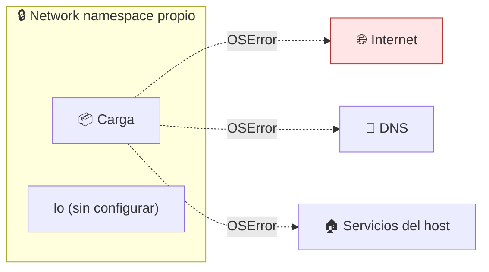

# Lab 09 · Control de salida de red

> **Nivel:** `core` · **Estado:** `ready`

Cortar la red por completo y demostrar que está cortada — no suponerlo.

---

## 🎯 Por qué importa

La red es el control con mayor retorno: sin salida, una carga que consiga leer
algo no puede sacarlo, y una carga que quiera descargar su segunda etapa no
puede. Es también el control más fácil de verificar, y por eso el mejor sitio
para aprender a **medir** contención en vez de declararla.

---

## 🗺️ Cómo funciona



---

## ▶️ Práctica

```bash
# Contraste directo: la misma sonda con y sin namespace de red
python3 workloads/escape/network-egress/probe.py                    # en el host
unshare --user --map-root-user --net python3 workloads/escape/network-egress/probe.py

# Medido por la suite, en todos los runtimes a la vez
cargo run -p sandboxctl -- escape 2>&1 | grep network
```

### Salida esperada

```text
probe=network-egress ... result=escaped detail=conexiones establecidas: dns-cloudflare,dns-google
probe=network-egress ... result=contained detail=sin salida TCP ni resolución DNS

network-egress    native ❌   bwrap ✅   unshare ✅
```

---

## ✅ Cómo se verifica

La sonda comprueba **dos cosas**: conexión TCP y resolución DNS. Un runtime
puede cortar el tráfico y dejar el resolutor accesible, y la resolución DNS por
sí sola ya filtra información (un nombre `datos-exfiltrados.atacante.com` viaja
igual de bien).

---

## 🏭 Caso de uso real

Ejecutar el `postinstall` de una dependencia npm sin salida de red: si el script
quería llamar a casa, falla de forma visible en vez de tener éxito en silencio.

---

## ⚠️ Errores comunes

- `--net` deja al proceso sin loopback configurado. Si tu carga habla consigo misma por TCP, tendrás que levantar `lo`.
- Una allowlist por host obliga a resolver nombres — es decir, a permitir DNS. Piensa si eso es aceptable antes de elegirla.

---

## 🧾 Evidencia

Cada ejecución con `sandboxctl run` deja un JSON en `evidence/runs/` con:

| Campo | Qué prueba |
|---|---|
| `integrity.policySha256` | Qué política exacta se aplicó |
| `integrity.workloadSha256` | Qué código exacto se ejecutó |
| `policy.effectiveControls` | Qué controles se aplicaron de verdad |
| `policy.unsupportedControls` | Qué pidió la política y no se pudo aplicar |
| `result` | Estado, código de salida y salida acotada |

Formato completo en [docs/EVIDENCE_FORMAT.md](../../docs/EVIDENCE_FORMAT.md).

---

## 🔗 Siguiente paso

**Lab 10 · Sandbox rootless completo** → [`10-rootless-sandbox/`](../10-rootless-sandbox/)

> [!WARNING]
> No ejecutes código desconocido en tu equipo de trabajo. `experimental` no
> significa apto para cargas hostiles: usa una VM que puedas destruir.
