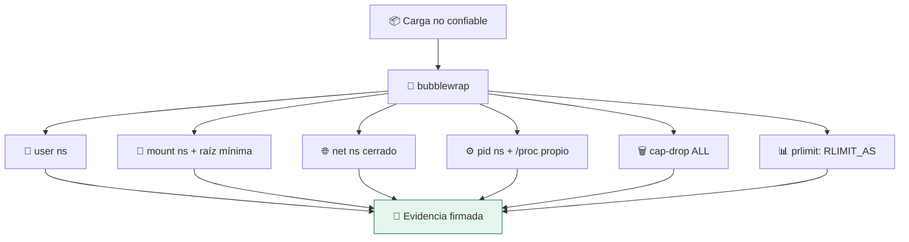

# Lab 10 · Sandbox rootless completo

> **Nivel:** `advanced` · **Estado:** `ready`

Componer namespaces, jaula de filesystem, capabilities y límites en un sandbox utilizable, sin root.

---

## 🎯 Por qué importa

Los laboratorios anteriores aíslan una dimensión cada uno. Este los junta y
responde la pregunta práctica: ¿cuánta contención se consigue **sin
privilegios**? La respuesta —todo menos el techo real de PIDs— es la que decide
si necesitas gVisor o una microVM.

---

## 🗺️ Cómo funciona



---

## ▶️ Práctica

```bash
# La matriz completa de este host
cargo run -p sandboxctl -- escape --runtime bwrap

# Coste de esa contención frente a no aislar
SANDBOX_LABS_ALLOW_NATIVE=1 cargo run -p sandboxctl -- bench --repeat 20

# El informe verificable
cargo run -p sandboxctl -- escape --runtime bwrap --report evidence/escape/bwrap.json
python3 -m json.tool evidence/escape/bwrap.json | head -30
```

### Salida esperada

```text
network-egress                     ✅
filesystem-escape                  ✅
process-visibility                 ✅
environment-leak                   ✅
privilege-check                    ✅
memory-limit                       ✅
process-limit                      ❌   → necesita cgroups v2

RUNTIME       p50 ms   SOBRECOSTE
native          9.48        1.00×
unshare        13.07        1.38×
```

---

## ✅ Cómo se verifica

CI ejecuta `escape --runtime bwrap --strict` en cada commit: si bubblewrap
dejara de contener cualquier dimensión, el build se cae. El `--strict` es lo que
convierte la suite en una puerta y no en un informe decorativo.

---

## 🏭 Caso de uso real

Un servicio que ejecuta código generado por un modelo: contención sin root,
arranque en milisegundos y evidencia firmada de qué se aplicó en cada ejecución.

---

## ⚠️ Errores comunes

- Rootless no cubre el techo de PIDs sin cgroups delegados. Si tu riesgo es el agotamiento de recursos, esto no basta.
- Un sandbox rootless comparte kernel con el host. Frente a una vulnerabilidad del kernel, la frontera es de papel — ahí empiezan los labs 11 a 13.

---

## 🧾 Evidencia

Cada ejecución con `sandboxctl run` deja un JSON en `evidence/runs/` con:

| Campo | Qué prueba |
|---|---|
| `integrity.policySha256` | Qué política exacta se aplicó |
| `integrity.workloadSha256` | Qué código exacto se ejecutó |
| `policy.effectiveControls` | Qué controles se aplicaron de verdad |
| `policy.unsupportedControls` | Qué pidió la política y no se pudo aplicar |
| `result` | Estado, código de salida y salida acotada |

Formato completo en [docs/EVIDENCE_FORMAT.md](../../docs/EVIDENCE_FORMAT.md).

---

## 🔗 Siguiente paso

**Lab 14 · WebAssembly y WASI: aislamiento por capacidades** → [`14-wasm-wasi/`](../14-wasm-wasi/)

> [!WARNING]
> No ejecutes código desconocido en tu equipo de trabajo. `experimental` no
> significa apto para cargas hostiles: usa una VM que puedas destruir.
