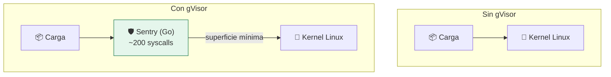

# Lab 11 · gVisor: un kernel en espacio de usuario

> **Nivel:** `advanced` · **Estado:** `documented`

Interponer un kernel escrito en Go entre la carga y el kernel real para reducir la superficie expuesta.

---

## 🎯 Por qué importa

Un sandbox rootless comparte kernel con el host: cualquier vulnerabilidad del
kernel atraviesa la frontera. gVisor implementa la mayoría de las syscalls en
espacio de usuario, de modo que la carga habla con Go, no con Linux. Se paga en
compatibilidad y en rendimiento.

---

## 🗺️ Cómo funciona



---

## ▶️ Práctica

```bash
# ¿Está runsc en este host?
cargo run -p sandboxctl -- doctor | grep gvisor

# El contrato y el backlog del adaptador
cat adapters/gvisor/README.md

# Qué haría el plan si estuviera implementado
cargo run -p sandboxctl -- plan \
  --workload workloads/benign/hello \
  --runtime gvisor --policy policies/high-risk.json
```

### Salida esperada

```text
⚪ gvisor       No such file or directory (os error 2)

  ⚠ runtime documentado/manual: requiere integración específica del host
```

---

## ✅ Cómo se verifica

**Estado honesto:** `documented`. El plan se compila y explica el bloqueo, pero
el adaptador no ejecuta. Una prueba de contrato verifica en cada commit que
`gvisor`, `kata` y `firecracker` **nunca** se marcan ejecutables: ver
`documented_runtimes_are_never_executable`.

---

## 🏭 Caso de uso real

Ejecución multi-tenant de código no confiable donde el coste de compatibilidad
es aceptable — es el modelo con el que Google Cloud Run aisló cargas de
clientes.

---

## ⚠️ Errores comunes

- No implementa todas las syscalls: cargas que usan `io_uring` o interfaces poco comunes fallan.
- El coste de E/S es notable. Mide con tu carga antes de decidir; el lab 17 sirve para eso.

---

## 🧾 Evidencia

Cada ejecución con `sandboxctl run` deja un JSON en `evidence/runs/` con:

| Campo | Qué prueba |
|---|---|
| `integrity.policySha256` | Qué política exacta se aplicó |
| `integrity.workloadSha256` | Qué código exacto se ejecutó |
| `policy.effectiveControls` | Qué controles se aplicaron de verdad |
| `policy.unsupportedControls` | Qué pidió la política y no se pudo aplicar |
| `result` | Estado, código de salida y salida acotada |

Formato completo en [docs/EVIDENCE_FORMAT.md](../../docs/EVIDENCE_FORMAT.md).

---

## 🔗 Siguiente paso

**Lab 12 · Kata Containers: frontera de hardware con interfaz de contenedor** → [`12-kata-containers/`](../12-kata-containers/)

> [!WARNING]
> No ejecutes código desconocido en tu equipo de trabajo. `experimental` no
> significa apto para cargas hostiles: usa una VM que puedas destruir.
