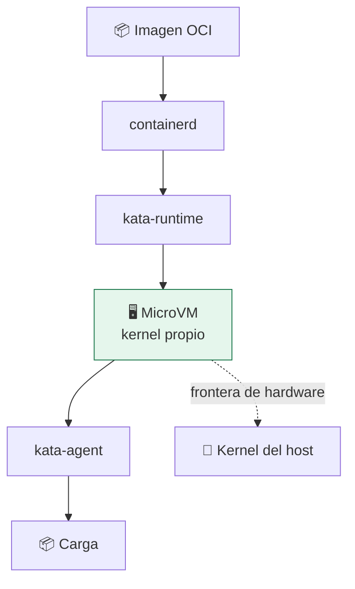

# Lab 12 · Kata Containers: frontera de hardware con interfaz de contenedor

> **Nivel:** `advanced` · **Estado:** `documented`

Ejecutar cada contenedor dentro de una máquina virtual ligera, manteniendo la interfaz OCI.

---

## 🎯 Por qué importa

Kata resuelve la tensión entre «quiero la frontera de una VM» y «quiero la
ergonomía de un contenedor». Cada pod arranca en su propia VM con su propio
kernel: una fuga del kernel del invitado no alcanza al host.

---

## 🗺️ Cómo funciona



---

## ▶️ Práctica

```bash
cargo run -p sandboxctl -- doctor | grep kata
cat adapters/kata/README.md

# El plan explica por qué no ejecuta
cargo run -p sandboxctl -- plan \
  --workload workloads/benign/hello \
  --runtime kata --policy policies/high-risk.json --json | \
  python3 -c "import json,sys;print(json.load(sys.stdin)['blockReason'])"
```

### Salida esperada

```text
⚪ kata         No such file or directory (os error 2)

runtime documentado/manual: requiere integración específica del host
```

---

## ✅ Cómo se verifica

**Estado honesto:** `manual`. Requiere containerd con el runtime registrado,
imagen de kernel y rootfs del invitado. El repositorio documenta el contrato y
se niega a ejecutar mientras no esté construido.

---

## 🏭 Caso de uso real

Un clúster Kubernetes compartido entre equipos que no confían entre sí, donde la
`RuntimeClass` decide qué cargas van a Kata y cuáles a runc.

---

## ⚠️ Errores comunes

- El arranque es de cientos de milisegundos, no de unidades. Para funciones efímeras puede no compensar.
- Necesita virtualización anidada si el host ya es una VM: en muchos CI eso no está disponible.

---

## 🧾 Evidencia

Cada ejecución con `sandboxctl run` deja un JSON en `evidence/runs/` con:

| Campo | Qué prueba |
|---|---|
| `integrity.policySha256` | Qué política exacta se aplicó |
| `integrity.workloadSha256` | Qué código exacto se ejecutó |
| `policy.effectiveControls` | Qué controles se aplicaron de verdad |
| `policy.unsupportedControls` | Qué pidió la política y no se pudo aplicar |
| `result` | Estado, código de salida y salida acotada |

Formato completo en [docs/EVIDENCE_FORMAT.md](../../docs/EVIDENCE_FORMAT.md).

---

## 🔗 Siguiente paso

**Lab 13 · Firecracker: microVM minimalista** → [`13-firecracker-microvm/`](../13-firecracker-microvm/)

> [!WARNING]
> No ejecutes código desconocido en tu equipo de trabajo. `experimental` no
> significa apto para cargas hostiles: usa una VM que puedas destruir.
