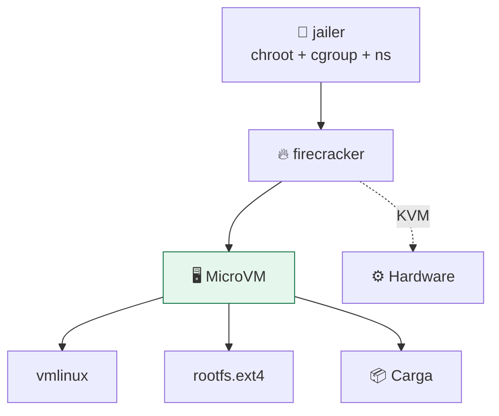

# Lab 13 · Firecracker: microVM minimalista

> **Nivel:** `advanced` · **Estado:** `manual`

La frontera más fuerte de este recorrido: una VM con dispositivos mínimos, pensada para densidad y multi-tenancy.

---

## 🎯 Por qué importa

Firecracker es el motor detrás de AWS Lambda y Fargate. Reduce el modelo de
dispositivos al mínimo (bloque, red, serie, teclado) para que la superficie del
hipervisor sea pequeña y el arranque quepa en decenas de milisegundos.

---

## 🗺️ Cómo funciona



---

## ▶️ Práctica

```bash
# ¿Hay KVM en este host?
cargo run -p sandboxctl -- doctor | grep -i kvm
ls -l /dev/kvm

cat adapters/firecracker/README.md
```

### Salida esperada

```text
✅ KVM            /dev/kvm
⚪ firecracker    No such file or directory (os error 2)
```

---

## ✅ Cómo se verifica

**Estado honesto:** `manual`. Requiere KVM, el binario `firecracker`, el
`jailer`, una imagen de kernel y un rootfs — artefactos que hay que construir y
validar por host. El repositorio no los descarga ni los genera automáticamente.

---

## 🏭 Caso de uso real

Una plataforma de funciones donde miles de invocaciones de clientes distintos
comparten máquina y el aislamiento tiene que ser de hardware.

---

## ⚠️ Errores comunes

- Sin `jailer` pierdes buena parte de la contención del propio proceso de Firecracker.
- El rootfs es tu responsabilidad: una imagen con binarios de más anula el minimalismo.

---

## 🧾 Evidencia

Cada ejecución con `sandboxctl run` deja un JSON en `evidence/runs/` con:

| Campo | Qué prueba |
|---|---|
| `integrity.policySha256` | Qué política exacta se aplicó |
| `integrity.workloadSha256` | Qué código exacto se ejecutó |
| `policy.effectiveControls` | Qué controles se aplicaron de verdad |
| `policy.unsupportedControls` | Qué pidió la política y no se pudo aplicar |
| `result` | Estado, código de salida y salida acotada |

Formato completo en [docs/EVIDENCE_FORMAT.md](../../docs/EVIDENCE_FORMAT.md).

---

## 🔗 Siguiente paso

**Lab 14 · WebAssembly y WASI: aislamiento por capacidades** → [`14-wasm-wasi/`](../14-wasm-wasi/)

> [!WARNING]
> No ejecutes código desconocido en tu equipo de trabajo. `experimental` no
> significa apto para cargas hostiles: usa una VM que puedas destruir.
