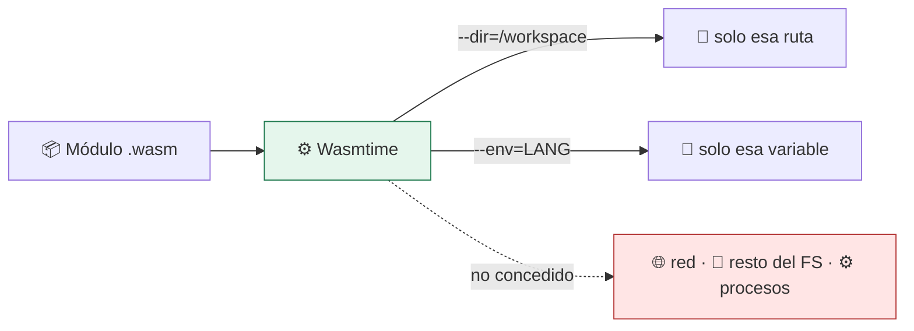

# Lab 14 · WebAssembly y WASI: aislamiento por capacidades

> **Nivel:** `advanced` · **Estado:** `documented`

Un modelo distinto: el módulo no ve nada salvo lo que se le concede explícitamente.

---

## 🎯 Por qué importa

Namespaces y VMs quitan acceso a un mundo que por defecto está completo. WASI
invierte la premisa: el módulo empieza sin nada y recibe capacidades una a una.
No hay `/proc` que ocultar ni PIDs que esconder porque no existen en el modelo.

---

## 🗺️ Cómo funciona



---

## ▶️ Práctica

```bash
# ¿Está wasmtime?
cargo run -p sandboxctl -- doctor | grep wasi

# Compilar el módulo del laboratorio
rustup target add wasm32-wasip1
bash labs/14-wasm-wasi/build-and-run.sh

# El aislamiento por capacidades, en la práctica
wasmtime run --dir=. hello.wasm      # solo ve el directorio concedido
```

### Salida esperada

```text
⚪ wasi         No such file or directory (os error 2)

# con wasmtime instalado:
hello from wasi
```

---

## ✅ Cómo se verifica

El control `filesystem` de WASI no se aplica montando nada: se aplica **no
concediendo** el preopen. Esa diferencia de modelo es la razón por la que este
laboratorio existe aparte.

---

## 🏭 Caso de uso real

Ejecutar plugins de terceros dentro de una aplicación sin proceso ni contenedor
de por medio: arranque en microsegundos y superficie mínima, a cambio de
recompilar la carga a wasm.

---

## ⚠️ Errores comunes

- Solo ejecuta código compilado a wasm. No sirve para binarios existentes ni para un `pip install` cualquiera.
- El soporte de hilos y de red sigue madurando en la especificación. Comprueba qué necesita tu carga.

---

## 🧾 Evidencia

Cada ejecución con `sandboxctl run` deja un JSON en `evidence/runs/` con:

| Campo | Qué prueba |
|---|---|
| `integrity.policySha256` | Qué política exacta se aplicó |
| `integrity.workloadSha256` | Qué código exacto se ejecutó |
| `policy.effectiveControls` | Qué controles se aplicaron de verdad |
| `policy.unsupportedControls` | Qué pidió la política y no se pudo aplicar |
| `result` | Estado, código de salida y salida acotada |

Formato completo en [docs/EVIDENCE_FORMAT.md](../../docs/EVIDENCE_FORMAT.md).

---

## 🔗 Siguiente paso

**Lab 15 · Ejecutor de código generado por IA** → [`15-ai-code-runner/`](../15-ai-code-runner/)

> [!WARNING]
> No ejecutes código desconocido en tu equipo de trabajo. `experimental` no
> significa apto para cargas hostiles: usa una VM que puedas destruir.
