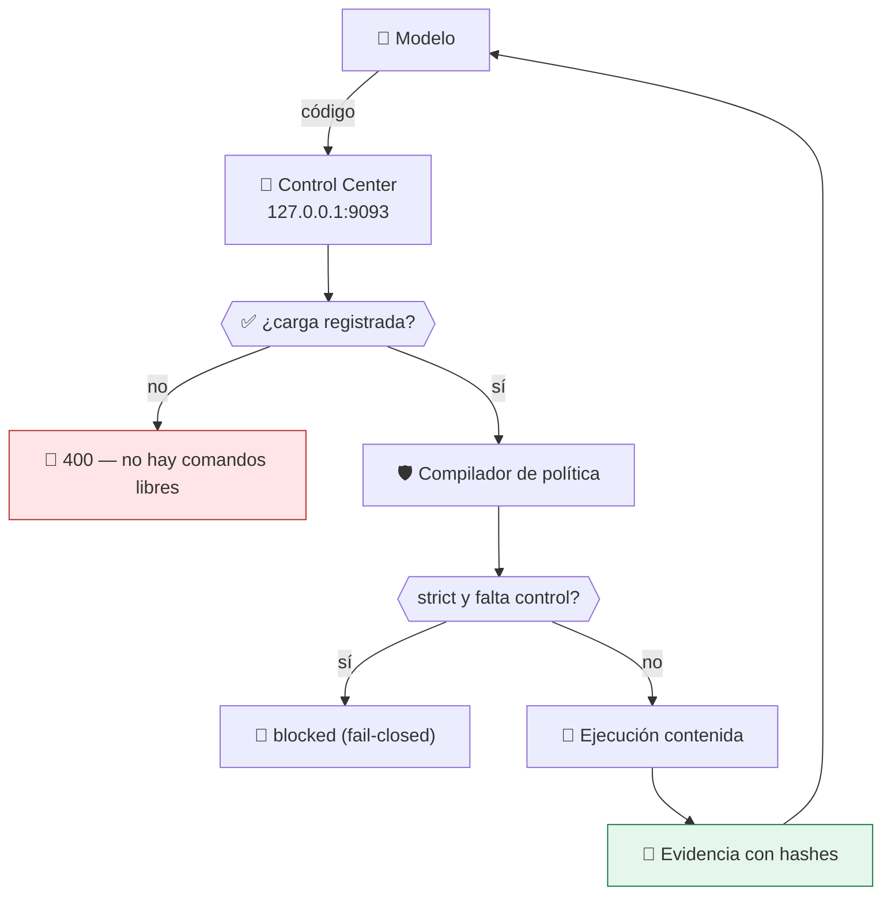

# Lab 15 · Ejecutor de código generado por IA

> **Nivel:** `platform` · **Estado:** `ready`

El caso de uso que motiva todo el repositorio: ejecutar código que nadie ha revisado, y poder demostrar bajo qué condiciones se ejecutó.

---

## 🎯 Por qué importa

Un asistente que genera código y lo ejecuta necesita responder tres preguntas
antes de cada ejecución: ¿qué se va a ejecutar?, ¿bajo qué controles?, ¿cómo lo
pruebo después? Sin las tres, «el agente ejecuta código en un sandbox» es una
afirmación sin respaldo.

---

## 🗺️ Cómo funciona



---

## ▶️ Práctica

```bash
# La política pensada para este caso
python3 -m json.tool policies/ai-agent-restricted.json

# El flujo completo, contenido y con evidencia
cargo run -p sandboxctl -- run \
  --workload workloads/benign/filesystem-probe \
  --runtime bwrap \
  --policy policies/ai-agent-restricted.json

# Qué contiene realmente esa política en este host
cargo run -p sandboxctl -- escape --policy policies/containment-audit.json --runtime bwrap

# La API que usaría el agente (sin campo de comando libre)
curl -s -X POST http://127.0.0.1:9093/api/jobs \
  -H 'content-type: application/json' -H 'x-sandbox-request: 1' \
  -d '{"workloadId":"filesystem-probe","policyId":"ai-agent-restricted","runtimeId":"bwrap","arguments":[]}'
```

### Salida esperada

```text
Estado: Completed
Evidencia: evidence/runs/<runId>.json

# La evidencia responde las tres preguntas:
"integrity": { "policySha256": "...", "workloadSha256": "...", "runnerSha256": "..." }
"policy":    { "effectiveControls": [...], "unsupportedControls": [] }
```

---

## ✅ Cómo se verifica

La API **no tiene** endpoint de comandos arbitrarios: solo acepta
identificadores del catálogo. CI lo comprueba en cada commit (`POST /api/exec` →
404) porque un panel local que ejecuta comandos libres es una shell remota con
otro nombre.

---

## 🏭 Caso de uso real

Un agente que resuelve tareas de datos: genera un script, lo registra como
carga, lo ejecuta con la red cerrada y solo escritura en `/workspace/output`, y
adjunta la evidencia al resultado.

---

## ⚠️ Errores comunes

- Registrar la carga no es burocracia: es lo que hace que el hash del código ejecutado quede en la evidencia.
- Si la política es `best-effort`, lee `unsupportedControls` en la evidencia antes de confiar en el resultado.

---

## 🧾 Evidencia

Cada ejecución con `sandboxctl run` deja un JSON en `evidence/runs/` con:

| Campo | Qué prueba |
|---|---|
| `integrity.policySha256` | Qué política exacta se aplicó |
| `integrity.workloadSha256` | Qué código exacto se ejecutó |
| `policy.effectiveControls` | Qué controles se aplicaron de verdad |
| `policy.unsupportedControls` | Qué pidió la política y no se pudo aplicar |
| `result` | Estado, código de salida y salida acotada |

Formato completo en [docs/EVIDENCE_FORMAT.md](../../docs/EVIDENCE_FORMAT.md).

---

## 🔗 Siguiente paso

**Lab 16 · Suite de contención** → [`16-escape-test-suite/`](../16-escape-test-suite/)

> [!WARNING]
> No ejecutes código desconocido en tu equipo de trabajo. `experimental` no
> significa apto para cargas hostiles: usa una VM que puedas destruir.
