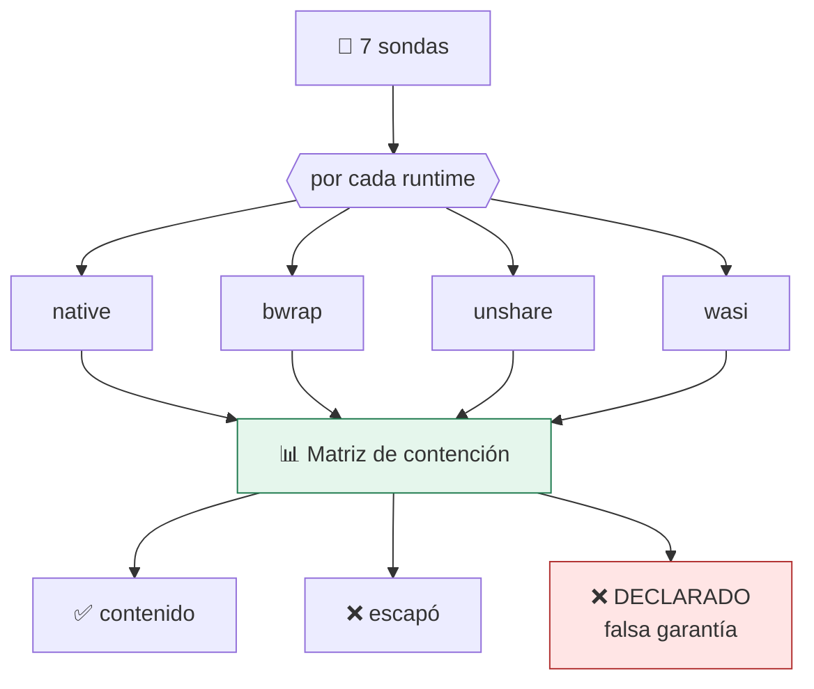

# Lab 16 · Suite de contención

> **Nivel:** `platform` · **Estado:** `ready`

Dejar de creer en los controles declarados y medirlos: sondas que intentan salirse y una matriz con el resultado.

---

## 🎯 Por qué importa

Un runtime puede declarar que aísla la red y no cortarla, porque falta un
binario, porque el kernel no lo permite o porque la política se compiló mal. La
distancia entre **declarado** y **efectivo** es exactamente donde viven los
incidentes. Esta suite la mide.

---

## 🗺️ Cómo funciona



---

## ▶️ Práctica

```bash
# La matriz completa de este host
cargo run -p sandboxctl -- escape

# Como puerta de CI: código 1 si algo escapa
cargo run -p sandboxctl -- escape --runtime bwrap --strict

# Informe verificable en JSON
cargo run -p sandboxctl -- escape --json --report evidence/escape/matriz.json

# Contraprueba obligatoria: sin aislamiento TIENE que escapar
SANDBOX_LABS_ALLOW_NATIVE=1 cargo run -p sandboxctl -- escape --runtime native
```

### Salida esperada

```text
DIMENSIÓN / SONDA             native         bwrap       unshare
────────────────────────────────────────────────────────────────
network-egress                     ❌             ✅             ✅
filesystem-escape                  ❌             ✅             ❌
process-visibility                 ❌             ✅             ✅
environment-leak                   ✅             ✅             ✅
privilege-check                    ✅             ✅             ✅
memory-limit                       —              ✅             ✅
process-limit                      —              ❌             ❌
```

---

## ✅ Cómo se verifica

El veredicto más importante no es ❌ sino **❌ DECLARADO**: el runtime dice que
aplica el control y la sonda demuestra que no. Es peor que no declararlo, porque
invita a confiar. La suite ya encontró dos casos reales en este repositorio: un
PID namespace sin `/proc` remontado y un `RLIMIT_NPROC` que no limitaba lo que
decía limitar.

---

## 🏭 Caso de uso real

Validar una plataforma de ejecución antes de darle tráfico de clientes, y volver
a validarla en cada actualización de kernel — que es cuando los controles se
rompen sin avisar.

---

## ⚠️ Errores comunes

- Una política `strict` bloquea la ejecución antes de medir. Para auditar se usa `containment-audit`, que es `best-effort` a propósito.
- «Sin fugas» significa «ninguna de estas siete sondas escapó», no «es seguro». La suite acota lo que sabes, no lo que temes.

---

## 🧾 Evidencia

Cada ejecución con `sandboxctl run` deja un JSON en `evidence/runs/` con:

| Campo | Qué prueba |
|---|---|
| `integrity.policySha256` | Qué política exacta se aplicó |
| `integrity.workloadSha256` | Qué código exacto se ejecutó |
| `policy.effectiveControls` | Qué controles se aplicaron de verdad |
| `policy.unsupportedControls` | Qué pidió la política y no se pudo aplicar |
| `result` | Estado, código de salida y salida acotada |

Formato completo en [docs/EVIDENCE_FORMAT.md](../../docs/EVIDENCE_FORMAT.md).

---

## 🔗 Siguiente paso

**Lab 17 · Comparativa entre fronteras** → [`17-sandbox-benchmarks/`](../17-sandbox-benchmarks/)

> [!WARNING]
> No ejecutes código desconocido en tu equipo de trabajo. `experimental` no
> significa apto para cargas hostiles: usa una VM que puedas destruir.
