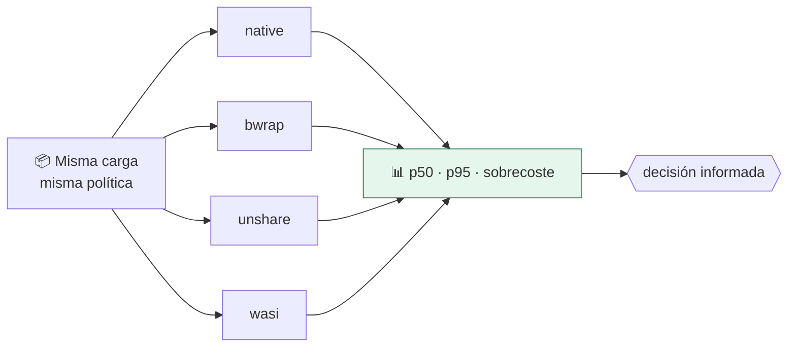

# Lab 17 · Comparativa entre fronteras

> **Nivel:** `platform` · **Estado:** `ready`

Medir cuánto cuesta cada frontera con la misma carga, para elegir con datos en vez de con intuición.

---

## 🎯 Por qué importa

Aislar cuesta. Un namespace de red se monta rápido; una microVM arranca un
kernel entero. Elegir sin medir lleva a dos errores simétricos: pagar de más por
una carga inofensiva, o quedarse corto con una que no lo es.

---

## 🗺️ Cómo funciona



---

## ▶️ Práctica

```bash
# Comparativa con calentamiento y percentiles
SANDBOX_LABS_ALLOW_NATIVE=1 cargo run -p sandboxctl -- bench --repeat 20

# Solo dos fronteras, en JSON
cargo run -p sandboxctl -- bench \
  --runtime bwrap --runtime unshare --json --report evidence/escape/bench.json
```

### Salida esperada

```text
RUNTIME         p50 ms    p95 ms    min ms    max ms  SOBRECOSTE
native            9.48     10.40      8.91     10.40       1.00×
unshare          13.07     13.42     12.15     13.42       1.38×
```

---

## ✅ Cómo se verifica

Se reporta **mediana y p95**, no solo la media: en tiempos de arranque la cola
importa más que el promedio, y una media sola esconde justo el caso que hará
esperar al usuario. La primera repetición es de calentamiento y no se cuenta.

---

## 🏭 Caso de uso real

Decidir si una función que se invoca 10.000 veces al día puede permitirse una
microVM, o si el sobrecoste obliga a un sandbox rootless con una política más
estricta.

---

## ⚠️ Errores comunes

- Compara siempre con la misma política: una `strict` bloquea a unos runtimes y a otros no, y entonces la comparación es entre cosas distintas.
- Un runtime rápido que falla la mitad de las repeticiones no es rápido. Mira la columna de fallos.

---

## 🧾 Evidencia

Cada ejecución con `sandboxctl run` deja un JSON en `evidence/runs/` con:

| Campo | Qué prueba |
|---|---|
| `integrity.policySha256` | Qué política exacta se aplicó |
| `integrity.workloadSha256` | Qué código exacto se ejecutó |
| `policy.effectiveControls` | Qué controles se aplicaron de verdad |
| `policy.unsupportedControls` | Qué pidió la política y no se pudo aplicar |
| `result` | Estado, código de salida y salida acotada |

Formato completo en [docs/EVIDENCE_FORMAT.md](../../docs/EVIDENCE_FORMAT.md).

---

## 🔗 Siguiente paso

**Lab 18 · Plataforma multi-tenant** → [`18-multi-tenant-platform/`](../18-multi-tenant-platform/)

> [!WARNING]
> No ejecutes código desconocido en tu equipo de trabajo. `experimental` no
> significa apto para cargas hostiles: usa una VM que puedas destruir.
