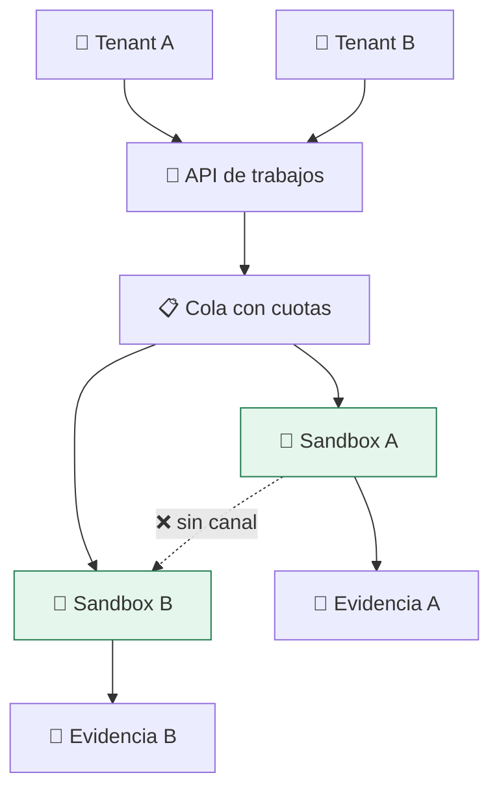

# Lab 18 · Plataforma multi-tenant

> **Nivel:** `platform` · **Estado:** `documented`

Juntarlo todo: varios inquilinos que no confían entre sí compartiendo una plataforma, con evidencia por ejecución.

---

## 🎯 Por qué importa

Los diecisiete laboratorios anteriores aíslan **una** carga. Una plataforma real
ejecuta muchas, de dueños distintos, a la vez. Aparecen problemas que no existen
con una sola: agotamiento de recursos entre vecinos, canales laterales, cuotas y
trazabilidad por inquilino.

---

## 🗺️ Cómo funciona



---

## ▶️ Práctica

```bash
# Lo que hoy sí existe: cola, cancelación, SSE y evidencia por trabajo
pnpm dashboard:build && pnpm dashboard:start

# Un trabajo por «inquilino», cada uno con su evidencia
curl -s http://127.0.0.1:9093/api/jobs | python3 -m json.tool | head -20
curl -s http://127.0.0.1:9093/api/evidence | python3 -m json.tool | head -20
```

### Salida esperada

```text
[ { "id": "...", "status": "completed", "evidenceId": "...", ... } ]
```

---

## ✅ Cómo se verifica

**Estado honesto:** la cola, la cancelación, el streaming de estado y la
evidencia por trabajo funcionan. Lo que **no** existe todavía es el modelo de
inquilinos: no hay identidad, ni cuotas por tenant, ni aislamiento de recursos
entre vecinos. Ver [el backlog](../../docs/IMPLEMENTATION_BACKLOG.md).

---

## 🏭 Caso de uso real

Una plataforma de notebooks compartida por varios equipos, donde el consumo de
uno no puede degradar al resto y cada ejecución debe poder auditarse meses
después.

---

## ⚠️ Errores comunes

- Sin techo real de PIDs y de memoria por tenant (cgroups v2), un vecino ruidoso tumba a los demás. Es el bloqueante principal.
- La trazabilidad por inquilino exige identidad en la petición. El panel actual no autentica: solo escucha en localhost.

---

## 🧾 Evidencia

Cada ejecución con `sandboxctl run` deja un JSON en `evidence/runs/` con:

| Campo | Qué prueba |
|---|---|
| `integrity.policySha256` | Qué política exacta se aplicó |
| `integrity.workloadSha256` | Qué código exacto se ejecutó |
| `policy.effectiveControls` | Qué controles se aplicaron de verdad |
| `policy.unsupportedControls` | Qué pidió la política y no se pudo aplicar |
| `result` | Estado, código de salida y salida acotada |

Formato completo en [docs/EVIDENCE_FORMAT.md](../../docs/EVIDENCE_FORMAT.md).

---

## 🔗 Siguiente paso

Has terminado el recorrido. Vuelve al [catálogo de laboratorios](../../docs/LABS_CATALOG.md) o revisa el [backlog de implementación](../../docs/IMPLEMENTATION_BACKLOG.md).

> [!WARNING]
> No ejecutes código desconocido en tu equipo de trabajo. `experimental` no
> significa apto para cargas hostiles: usa una VM que puedas destruir.
